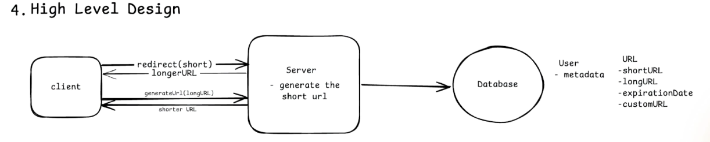
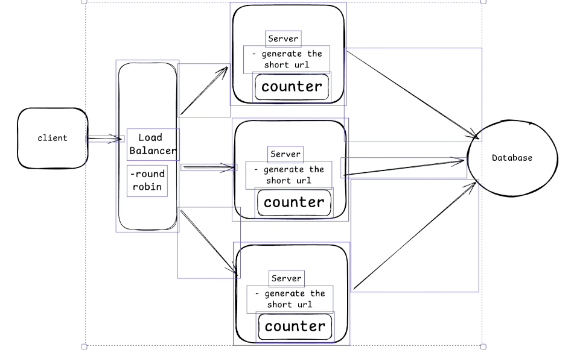
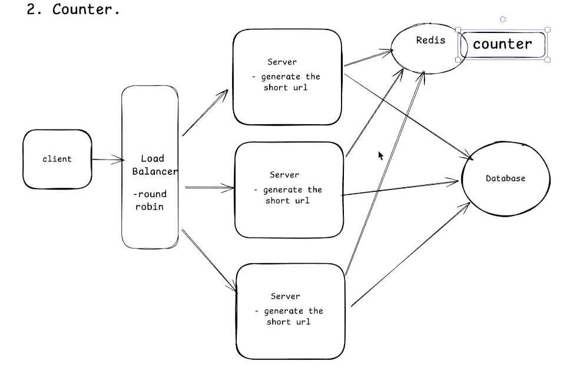
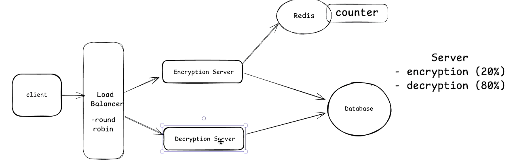
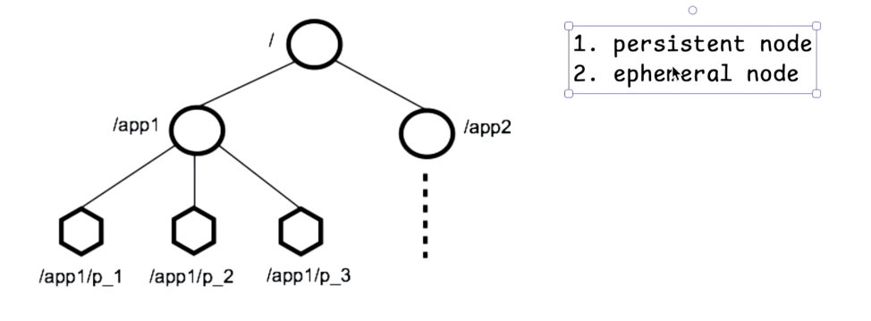

# URL Shortener (bit.ly) - System Design

> Framework: A 5-step process commonly used to approach almost any system design problem.

## The 5-Step Framework
1. Gather requirements (functional + non-functional)
2. Identify core entities
3. API design
4. High-level design (HLD)
5. Low-level design (LLD)

---

## Step 1 - Requirements Gathering
The interviewer usually provides a vague question (e.g., "design a URL shortener like bit.ly"). Asking clarifying questions is **your** responsibility. Wrap up this step in the first **10–15 minutes** of the 45-minute interview round so you have enough time to design the solution.

### Functional Requirements
1. Long URL → short URL generation
2. Short URL → original (long) URL redirection
3. **Optional (premium):** Custom alias - user defines their own short code
4. **Optional (premium):** Expiration date (default e.g., 90 days)

### Non-Functional Requirements
1. **Low latency (~200 ms):** Specify *where* this applies (both creation and redirection). Always quantify NFRs.
2. **Scale:** 100M Daily Active Users (DAU) / 1B URLs. A monolithic architecture is impossible here; distributed/microservices are required.
3. **Uniqueness:** The short URL must be unique (no duplicates).
4. **CAP Theorem:** Availability > Consistency.
   - In a distributed system, you must compromise between Availability and Consistency.
   - Availability means the site is always up (for both creation and redirection); downtime means losing users.
   - Strict consistency is not necessary here: there is a natural time gap between creating a URL and sharing it, so a slight propagation delay is acceptable → **eventual consistency** (redirects happen within ~200 ms; 0 seconds is not required).
   - Contrast: Banking or ticket booking systems require strict read-after-write consistency.

---

## Step 2 - Core Entities
1. Short URL
2. Long URL
3. User

---

## Step 3 - API Design
(A direct 1:1 mapping to the functional requirements)

```http
POST /v1/urls              → returns short URL
Body: {
  long_url,
  custom_url?,             # optional (premium feature)
  expiration_date?         # optional (premium feature)
}

GET /v1/{short_url}        → returns long URL (triggers redirect)
```

---

## Step 4 - High-Level Design



**Data flow:**
- **Create:** The client calls `generateURL(long_url)` → the server computes the short URL → saves the (short, long) mapping in the DB → returns the short URL.
- **Redirect:** The client hits the short URL → the server looks up the DB → returns the long URL → the user is redirected.

**Database tables:**

| Table | Attributes |
|-------|------------|
| User  | User metadata (premium status, etc.) |
| URL   | short_url, long_url, custom_url, expiration_date |

---

## Step 5 - Low-Level Design (Shortening logic: 3 approaches)

### Approach 1 - Hashing (MD5 / SHA-1 / Base64)
- encrypt(long_url) → MD5 produces 32 chars, SHA-1 produces 40 chars → too long for a short URL.
- Fix: Truncate and return only the first **6–7 characters**.
- ❌ **Problem: Truncation causes collisions.**
  - amazon.com might hash to `012345abcd`
  - amazon.in might hash to `012345abcd1`
  - Truncating both yields `012345` → duplicate short URLs!
- Mitigation: Check the DB before returning the string; if a collision occurs, append a key and re-hash.
- **Latency math (mock numbers):** Encrypt (1 ms) + DB write (5 ms) + DB scan (10 ms) = **16 ms**. One collision adds another 16 ms. Multiple collisions → unbounded latency → terrible user experience at a 1B scale.
-  Only viable for small-scale systems with a low volume of URLs.

### Approach 2 - Counter (Auto-increment unique ID)
- Assign the next counter value to each request → uniqueness by construction → no DB scan required to check for duplicates.
- Latency drops from 16 ms to **~6 ms**.
- ❌ **Problem:** A single server counter creates a monolith → cannot handle 100M DAU.
  - Vertical scaling is not feasible (hardware limits) → use **horizontal scaling**: replicate servers behind a load balancer (round-robin algorithm).



- ❌ **New Problem: Each server's local counter causes collisions.**
  - Initial counters: Server 1=0, Server 2=0, Server 3=0.
  - req1 → S1 → returns 0 (counters become 1,0,0)
  - req2 → S1 → returns 1 (counters become 2,0,0)
  - req3 → S2 → returns 0 ❌ duplicate (Server 2's local counter was still 0).
- **Fix:** Use a global counter stored in a **Redis cache** (Redis is single-threaded, so increments are atomic), taking ~2–3 ms.



- ❌ A single Redis instance = **single point of failure**.
- Using a Redis **cluster** solves availability but brings back the duplicate counter issue across different nodes.
- 📌 *Interview Tip:* Presenting this approach along with its pros and cons is often enough to pass the interview.

#### Optimization - Separation of Concerns (20/80 Rule)
- ~20% of traffic creates URLs (encrypt); ~80% performs redirects (decrypt).
- Split into separate microservices and scale independently: fewer instances for encryption, more instances for decryption.



#### Optimization - Cache Layer for Redirects
- Every redirect hitting the DB (10 ms scan) is expensive → add a Redis cache layer before the DB.
- Check Redis first; hit the DB only on a cache miss. Redirect latency drops from ~16 ms to **~7 ms**.
- Set a **TTL (Time-To-Live)** on cache entries so hot keys eventually expire.

### Approach 3 - ZooKeeper + Snowflake ID (Hybrid, most robust) 

**ZooKeeper basics:**
- A distributed, open-source coordination service used for configuration management, naming, synchronization, distributed locking, and group services. Think of it as a monitor/coordinator for a distributed system.
- Data is stored in a tree/directory structure. It has two node types:
  1. **Persistent node:** Data survives even if the application dies.
  2. **Ephemeral node:** Deleted when the application dies; death is detected via a **heartbeat** timeout.



**How it is used here:**
- At boot time, every encryption server registers with ZooKeeper to get a unique **worker ID**.
- The global counter is stored in ZooKeeper's **persistent layer** (it is never deleted; if ZK goes down, it recovers from logs).
- Each server also maintains a **local counter** (used for sequence bits).
- **Snowflake ID (64-bit):** Generated entirely locally per request without third-party calls.

  | Bits | Meaning |
  |------|---------|
  | 1    | Sign bit (+) |
  | 41   | Timestamp |
  | 10   | Worker ID (provided by ZooKeeper) |
  | 12   | Local sequence / counter |

- Lowest latency (no external calls per request) and 100% unique IDs.
- ZooKeeper is only called at **boot time** → if ZK goes down later, ID generation continues flawlessly.
- If a server dies, the Load Balancer routes traffic to live servers. A restarted server fetches a new worker ID and rejoins.
- **Final step:** Hash the 64-bit Snowflake ID with MD5/SHA-1 and take the first 6–7 characters.
  - Why is this safe from collisions (unlike Approach 1)? Because the input key (Snowflake ID) is completely unique and entirely in our control. The probability of a duplicate prefix is virtually zero.

---

## Handling Remaining Requirements

### Expiration
- Save the creation date + expiration date in the DB. A daily **cron job** runs and deletes expired records.
- Assign a **TTL** to Redis entries. Otherwise, hot keys might survive in the cache and serve expired URLs to users even after the cron job deletes them from the DB.

### Custom URL
- A premium user suggests an alias → check DB availability → if free, assign it; otherwise, prompt the user to choose a different alias.

### Redirect - 301 vs 302 HTTP Status Codes

| | 301 (Permanent Redirect) | 302 (Temporary Redirect) |
|---|---|---|
| **Browser Caching** | Browser caches the mapping locally. | Browser does not cache the mapping. |
| **Server Traffic** | Subsequent requests bypass the server (lower traffic). | Every request hits the server (higher traffic). |
| **Analytics / Logging** | Not possible (server doesn't see the hit). |  Possible (enables hit counts, user dashboards, AI/ML data gathering). |

Discuss this trade-off with the interviewer based on the specific business needs.

### Database Choice
- The data structure is essentially a simple key-value pair (+ dates) → **PostgreSQL or MySQL** is perfectly fine.
- **Crucial:** Create an **index on `short_url` (Primary Key)**, as every single lookup will be based on the short URL.

---

## Interview Tips
- Finish requirements gathering within the first 10–15 minutes; do not over-invest time here.
- Always quantify NFRs ("200 ms") and specify exactly where they apply.
- Show the evolution of your design: explain the pros and cons of each approach, then converge on the final hybrid solution.